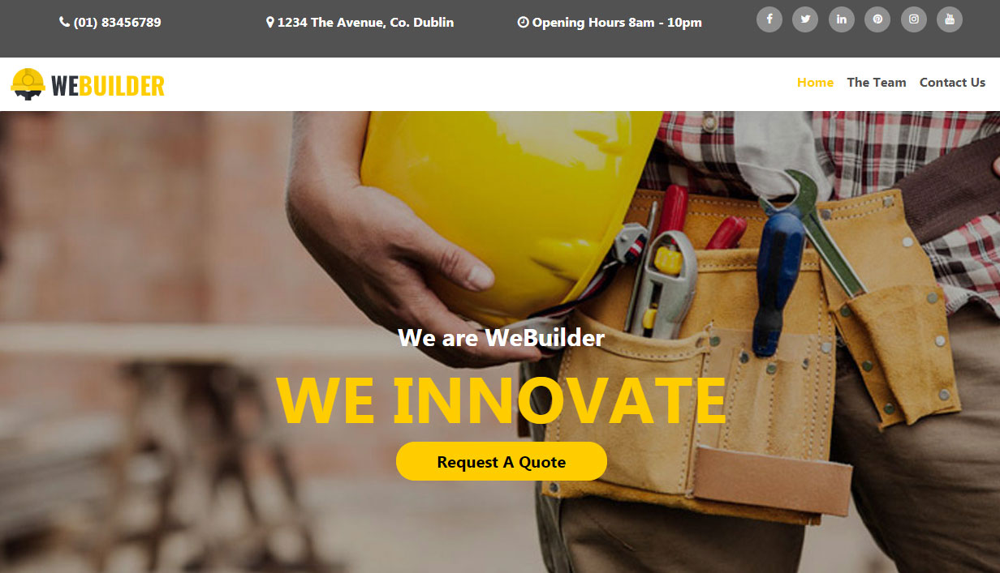

You can check out my milestone at -   https://github.com/Scorptech/MilestoneOne

The idea for this mock up website came about when speaking a builder that has been doing work for my family over the last few years.  The builders name is “Willie” and he is highly recommended by everyone as his workmanship and project management skills have always been spot on, hence why he is always in demand.

After having Willie complete some work for a family member I found out that this is something that he would like to do but just does not have the time to allocate to it. So for my first milestone project, I wanted to design a mock up site for Willie so the next time I see him, I can show him.

His business is unique as he offers a “turnkey” solution. So instead of customers hiring a builder, plumber, electrician etc, Willie can come in and project managed the development as he has his own team of people covering all the areas required for construction. This takes a huge amount of stress off the customer. 

Normally companies would have a photo gallery of previous work but we all know that some of these companies download library images for their website, hence why there is no photo gallery of previous work on the website. Willie prefers customers to visit customers and see the work for themselves. In most cases, this is how he gets new business, people seeing his work and then they contact him. 

So the website is purely for customers who just want to get a ball park figure regarding costs. Then they can decide if they want to move forward after Willie has given them the quote. In most cases, this is what people want to know i.e. this is what I want, how much will it cost me?

The business goals of this website are:

-   To give people the option to request a quote without phoning Willie and taking up his time
-   The give customers an uncluttered, easy to use and graphically pleasing website experience
-   To allow customer to request for quotes 24/7 and to also request information regarding         previous work

The customer goals of this website are:

-   Searching for a building company that can offer a “turnkey” solution for their project.
-   Clear easy navigation.
-   Information that they are members of the builders & tradesman Guild for peace of mind

## UX

#### Ideal client

##### The ideal client for this business is:

-   English speaking.
-   Has funding for the project they require
-   Are happy to leave Willie and his team to get on with the work without micro-managing 
-   Understands that building regulations can affect the cost of a project  

##### Visitors to this website are searching for:

-   A company that can offer a turnkey solution and manage their project from start to finish
-   Being patient regarding their quote request as building regulation information might need      to be researched before an estimated quote is provided

##### This project is the best way to help them achieve these things because:

-   Most builders do not have a website.
-   Most of the builders websites on the internet that are active, do not offer a turnkey          solution
-   You will be given the option to visit work completed with previous customers.

-   This website is:

-   Easy to navigate.
-   Easy to understand and navigate the information.
-   Gives the client the ability to request a quote 24/7.
-   Guiding them to the goal of the website – request a quote or fill out the contact form.

##### Client stories

1.  As a new visitor to the website, I want to easily navigate the site and feel comfortable with the builder and his commitment 
2.  As a new visitor to the website, I want the ability to request a quote for some construction  work I require. A ball park figure is all I need now,         which will determine whether I go ahead with the construction. 
3.  As a potential client, I want the option to view the builders previous work and speak to existing customers regarding the service they received.
6.  As an interested client, I want to understand what might be involved in a project before I make an decisions. The ability to request a quote means that     I will receive information that will be me an initial idea as to whether I can proceed with the project.
7.  As an interested client, I want an easy to fill in contact form, so I can make contact with the builder should I need general building information.
8.  As an interested observer and/or potential client, I want to follow the builder on social media to keep up with his latest news.
9.  As a returning visitor to the website, who has already decided to contact the builder using the contact form, I want to be able to find the request a quote based on my initial enquiry.

##### Wireframe mockups:

## Features

Each page has the company details at the **Top Bar** which has company details and also the **Social media Icons** for social media pages.
Each page features a responsive **navigation bar** with conventional placing of **logo** (top left). Each page has a **footer** with **copyright information** and **social media icons** linking to 6 social media pages.

Every page has **consistent design** except for the content section which displays the relevant information for that selected page.

##### Home

The Home page features a **image carousel** which gives an animated feel to the website for maximum impact on arriving at the website. This is switched off  while not using up people's data unnecessarily on mobile and tablet devices.

Ther are two modal buttons which you can press to **request a qoute** from the builder.  

##### The Team

The Team page features **Staff Cards** which change from color to black and white when you hover over the images. It is always good to see who
the people are that work for the company which makes a more _personal_.

At the bottom of the page (above the footer) are is a yellow bar with more **company information**. 

##### Contact
The Contact page features a **contact form**, which requests client name and email and below that a box to leave a message. The bottom of the form contains a **Send Button**

### Existing Features

-   Header Logo - Exists on [every page](https://scorptech.github.io/milestoneone/index.html). 
    Clicking the logo returns the user to the home page as they would expect.

-   Header Navigation Bar - Exists on [every page](https://scorptech.github.io/milestoneone/index.html) 
    and allows all users to easily navigate all the website's pages and find what they are looking for quickly.

-   Footer Copyright Info - Exists on [every page](https://scorptech.github.io/milestoneone/index.html/
    Protects business copyright.

-   Footer Social Icons - Exist on [every page](https://scorptech.github.io/milestoneone/index.html)
    and allows all users to access the social platforms that the artist uses.

-   Request A Quote button - Exist on [every page](https://scorptech.github.io/milestoneone/index.html)
    which enables the customer to request a quote for work that they need carrying out.

-   [The Team](https://scorptech.github.io/milestoneone/theteam.html)) 
    Allows potential clients to see the staff and who is involved in the company.

-   [Contact Form](https://scorptech.github.io/milestoneone/theteam.html) 
    Allows potential clients to ask questions, and/or make the first step with their queries.

### Features to Implement in future

-   GDPR compliant pop-up screen - Allows all new visitors to the website to approve or deny the processing of their personal data. Ensures the business        complies with the EU data protection law. - Javascript Needed
-   Add CAPTCHA to contact form - Allows business to protect the contact form from spam. - Javascript Needed
-   contact form Send button change from _Send_ to _Processing_ and then when complete changes to _Sent_. - Javascript Needed
-   FAQ page, table with FAQs and dropdown buttons to view answers - Gives potential customers easy to find answers to their common questions. - Javascript     Needed for dropdown functionality. Simple FAQ page could be implemented now.

## Technologies Used

-   This project uses HTML and CSS programming languages.
-   [Visual Studio Code](https://code.visualstudio.com/) - This developer used **Visual Studio Code** for their IDE while building the website.
-   [BootstrapCDN](https://www.bootstrapcdn.com/)
-   The project uses **Bootstrap4** to simplify the structure of the website and make the website responsive easily.
-   The project also uses BootstrapCDN to provide icons from [FontAwesome](https://www.bootstrapcdn.com/fontawesome/)
-   [Google Fonts](https://fonts.google.com/)
-   The project uses **Google fonts** to style the website fonts.

## Deployment

This project was developed using [Visual Studio Code IDE ](https://https://code.visualstudio.com), committed to git and pushed to GitHub using the github windows desktop version for visual studio code.

To deploy this page to GitHub Pages from its [GitHub repository](https://scorptech.github.io/milestoneone/), the following steps were taken:

1.  Log into GitHub.
2.  From the list of repositories on the screen, select **Scorptech/milestoneone**.
3.  From the menu items near the top of the page, select **Settings**.
4.  Scroll down to the **GitHub Pages** section.
5.  Under **Source** click the drop-down menu labelled **None** and select **Master Branch**
6.  On selecting Master Branch the page is automatically refreshed, the website is now deployed.
7.  Scroll back down to the **GitHub Pages** section to retrieve the link to the deployed website.

At the moment of submitting this Milestone project the Development Branch and Master Branch are identical.

### How to run this project locally

To clone this project from GitHub:

1.  Follow this link to the [Project GitHub repository](https://scorptech.github.io/milestoneone).
2.  Under the repository name, click "Clone or download".
3.  In the Clone with HTTPs section, copy the clone URL for the repository.
4.  In your local IDE open Git Bash.
5.  Change the current working directory to the location where you want the cloned directory to be made.
6.  Type `git clone`, and then paste the URL you copied in Step 3.

git clone https://github.com/USERNAME/REPOSITORY

7.  Press Enter. Your local clone will be created.

Further reading and troubleshooting on cloning a repository from GitHub [here](https://help.github.com/en/articles/cloning-a-repository).

## Credits

### Content

-   The text for the Home page and About page was created for Alan Maher by (www.linkedin.com/in/alanjmaher).
-   The text for the rest of the website was created by Alan Maher and proof-read/edited(www.linkedin.com/in/alanjmaher).

### Media

-   All the images used in this site were obtained from a free website theme by Rocky Ahmed.

### Code

-   Some of the CSS code was taken from the https://getbootstrap.com/ 

### Acknowledgements

-   I received inspiration for this project after dealing with the family builder, Willie, go about project managing a building contract for my mother-in-law and seeing the re-development first hand. 

-   My mentor Simen Daehlin guided me on how to investigate and find CSS issues using the inspect tool like a detective looking for evidence! 

#### Disclaimer

-   This website is purely a mock up and was not designed to be a working, commercial website.  

Many thanks! 

Alan

